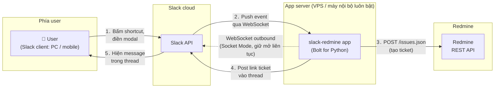

# slack-redmine

Slack app tạo Redmine ticket từ một message trong Slack.

Chọn một message → `⋮` (More actions) → **Create Redmine ticket** → modal hiện ra: Tracker, Subject/Description prefill từ nội dung message (sửa được), Assignee, và ở gần cuối là Project (chọn sẵn project map với channel, đổi được khi cần) → Submit → issue được tạo trong project đã chọn, và link ticket được post lại vào thread của message gốc:

> [NEW] [Feature #21814: Subject của ticket](https://redmine.example.com/issues/21814) — ticket đã được tạo trong project **Project Name**

Tiền tố `[NEW]` là status hiện tại của ticket trên Redmine. Mỗi ngày một lần app kiểm tra lại Redmine và sửa tiền tố khi status đổi (`[IN PROGRESS]`, `[CLOSED]`...), nên nhìn Slack là biết ticket xong chưa mà không cần mở Redmine. Muốn cập nhật ngay: chọn message → `⋮` → **Check Redmine status** (dùng được với cả message do người viết có chứa link Redmine; khi đó bot post một reply status trong thread).

Ticket đứng tên (author) chính người tạo — app match email Slack ↔ email Redmine và impersonate qua header `X-Redmine-Switch-User`; không match được (hoặc người đó thiếu quyền) thì ticket đứng tên user của API key.

Spec chi tiết: [docs/spec.md](../../docs/spec.md).

## Kiến trúc

Dùng [Bolt for Python](https://slack.dev/bolt-python/) + **Socket Mode**: app tự mở kết nối WebSocket ra Slack, không cần public IP/HTTPS endpoint — chạy được trên VPS hoặc máy nội bộ luôn bật. App gọi Redmine qua REST API, không cần cài plugin vào Redmine.



Điểm mấu chốt: user không bao giờ kết nối trực tiếp tới app server — mọi tương tác đi qua Slack. App chỉ cần outbound internet (mũi tên nét đứt là kết nối WebSocket do app chủ động mở ra và giữ liên tục; Slack đẩy sự kiện xuống qua kết nối này, không phải app polling).

## Setup

### Phía Redmine

1. Bật REST API: Administration → Settings → API → **Enable REST web service**.
2. Tạo user riêng kiểu `slack-bot`, cấp quyền add issue vào các project liên quan, lấy API key (My account → API access key).
   - Nên dùng API key của user có quyền **admin**: cần cho tính năng *default assignee theo email* và *author = người tạo* (impersonation). Key không phải admin thì app vẫn chạy nhưng mất 2 tính năng này.

### Phía Slack ([api.slack.com/apps](https://api.slack.com/apps) → Create New App)

Cách nhanh: chọn **From a manifest**, dán nội dung [slack-app-manifest.yml](slack-app-manifest.yml) — shortcut, Interactivity và scopes được cấu hình sẵn. Lúc tạo, Slack có thể cảnh báo Socket Mode chưa enable — bình thường, vì Socket Mode cần App-Level Token mà token chỉ tạo được sau khi app tồn tại. Sau khi tạo xong app:

1. **Settings → Socket Mode** → gạt **Enable Socket Mode** → dialog hiện ra yêu cầu tạo App-Level Token (scope `connections:write` có sẵn) → Generate → copy token `xapp-...` (điền vào `SLACK_APP_TOKEN`; token chỉ hiện một lần, xem lại ở Basic Information → App-Level Tokens).
2. **OAuth & Permissions** → Install to Workspace, lấy Bot Token `xoxb-...` (điền vào `SLACK_BOT_TOKEN`).
3. `/invite` bot vào các channel muốn dùng (cần để bot post được vào thread).
   - Scope `channels:history` + `groups:history` chỉ để shortcut **Check Redmine status** tìm reply status cũ của bot trong thread mà cập nhật thay vì post thêm; thiếu thì mỗi lần bấm bot post một reply mới.
   - Scope `channels:read` + `groups:read` chỉ để app ghi tên channel vào cột `channel_name` của file mapping; thiếu thì cột đó để trống, app vẫn chạy.
   - **Quên invite** (nhất là channel private): ticket vẫn được tạo nhưng bot không post được vào thread (`channel_not_found`), cũng không gửi được ephemeral. Khi đó app nhắn DM cho người tạo, kèm link ticket và nhắc invite bot. DM cần scope `im:write` (có sẵn trong manifest; app tạo trước khi có scope này thì thêm ở OAuth & Permissions rồi **Reinstall to Workspace**). Không có scope thì chỉ ghi log.

<details>
<summary>Cấu hình tay (nếu không dùng manifest — chọn Blank app)</summary>

1. **Interactivity & Shortcuts**: bật Interactivity, tạo 2 Shortcut loại *On messages*, callback ID: `create_redmine_ticket` và `check_redmine_status`.
2. **Socket Mode**: bật, tạo App-Level Token với scope `connections:write` (token `xapp-...`).
3. **OAuth & Permissions** — thêm Bot Token Scopes: `commands`, `chat:write`, `users:read`, `users:read.email`, `im:write`, `channels:read`, `groups:read`, `channels:history`, `groups:history` → Install to Workspace, lấy Bot Token (`xoxb-...`).
4. `/invite` bot vào các channel muốn dùng.

</details>

### Cấu hình app

```bash
cp .env.example .env          # điền token Slack, URL + API key Redmine
cp config.json.example config.json   # default project / ngôn ngữ
```

`config.json` — setting tĩnh, người sửa tay, đổi xong cần restart:

```json
{
  "default_project": "general",
  "default_language": "vi",
  "status_check_time": "07:00",
  "status_track_days": 90
}
```

- `default_project`: project chọn sẵn trong modal khi channel chưa được map. Để `null` thì modal mở ra với ô Project trống, người dùng phải tự chọn.
- `default_language`: ngôn ngữ mặc định của message bot post lại vào thread — `vi` (tiếng Việt, mặc định) hoặc `ja` (tiếng Nhật). Người dùng đổi được cho từng ticket bằng ô **Reply language** ở cuối modal.

- `status_check_time`: giờ (local, `HH:MM`) chạy job cập nhật status hằng ngày; mặc định `07:00`. Ngoài ra job chạy một lần 30 giây sau khi app khởi động.
- `status_track_days`: theo dõi message trong bao nhiêu ngày kể từ lúc post; mặc định 90. Quá hạn thì app ngừng theo dõi (message giữ nguyên tiền tố cuối cùng).

`slack-redmine-mapping.csv` — mapping Slack channel → Redmine project. **App tự ghi file này**, không cần tạo trước:

```csv
channel_id,project,channel_name,note
C0123456789,project-a,dev-team,Ghi chú tuỳ ý
C0987654321,project-b,,
```

- `channel_id`: Slack channel ID (right-click channel → View channel details → cuối popup). `project`: Redmine project identifier. `channel_name`: app tự điền tên channel khi ghi (cần scope `channels:read`/`groups:read`, thiếu thì để trống). `note`: ghi chú tự do của người, app không bao giờ sửa.
- **Cách thêm mapping thông thường**: trong channel đó, tạo ticket → ở modal chọn Project mong muốn (dropdown liệt kê mọi project có trong Redmine) → tích **Remember this project for this channel** → Create. App ghi vào CSV ngay, lần sau modal chọn sẵn project đó. Muốn đổi project của channel thì làm y như vậy với project khác.
- Sửa tay file CSV cũng được (Excel, editor); app đọc lại file mỗi lần mở modal nên **không cần restart**.
- Nâng cấp từ bản cũ: nếu `config.json` còn key `slack_channel_redmine_project_map` và chưa có CSV, app tự chuyển sang CSV lúc khởi động và ghi log; sau đó xoá key đó khỏi `config.json` (còn để thì app bỏ qua và cảnh báo mỗi lần start).

`posted-messages.csv` — danh sách message bot đã post kèm issue ID, **app tự ghi**, dùng cho job cập nhật status. Không cần tạo hay sửa. Chỉ message post sau khi có tính năng này mới được theo dõi; message cũ hơn thì dùng shortcut **Check Redmine status** để cập nhật tay (bot sẽ theo dõi từ đó).

**Custom field bắt buộc**: project nào có custom field đánh dấu *Required* (ví dụ *Acceptance Criteria*) thì modal tự thêm ô nhập cho field đó, nếu không Redmine sẽ từ chối tạo ticket (422). Cần API key admin để app đọc được định nghĩa custom field (`/custom_fields.json`); key thường thì modal không hiện ô này và tạo ticket sẽ báo lỗi kèm lý do từ Redmine. Hỗ trợ các kiểu text, string, int, float, link, list, enumeration, bool, date; kiểu user/version/attachment thì bỏ qua. Ô nhập luôn là bắt buộc trong modal (modal không đổi được theo tracker đang chọn); field chỉ dùng cho một số tracker thì có hint "Used by tracker: ...", chọn tracker khác thì Redmine bỏ qua giá trị đó.

## Chạy

```bash
python -m venv .venv
.venv/bin/pip install -r requirements.txt   # Windows: .venv\Scripts\pip
.venv/bin/python app.py
```

Chạy trực tiếp như trên chỉ để thử; app phải chạy liên tục (giữ WebSocket tới Slack) nên trên Linux nên chạy như systemd service — xem bên dưới.

<details>
<summary>Lỗi <code>ensurepip is not available</code> khi tạo venv (Debian/Ubuntu)</summary>

Debian/Ubuntu tách `venv`/`ensurepip` ra gói riêng. Cách chuẩn là cài gói đó (cần root, thay `3.x` bằng version python đang dùng):

```bash
sudo apt install python3.x-venv
```

Không có root: tạo venv không kèm pip rồi dùng pip có sẵn ở user site (`~/.local/bin/pip`) cài thẳng vào venv:

```bash
python3 -m venv --without-pip .venv
python3 -m pip --python .venv/bin/python install -r requirements.txt
```

</details>

### Chạy như service (systemd)

Có hai cách, chọn một:

| | System service (`/etc/systemd/system`) | User service (`~/.config/systemd/user`) |
|---|---|---|
| Cần root | Có (`sudo`) | Không |
| Chạy bằng user | Do `User=` trong unit quyết định | Chính user tạo service |
| Tự chạy khi boot | Có | Có, **nếu đã bật linger** (xem dưới) |
| Lệnh quản lý | `sudo systemctl ...` | `systemctl --user ...` |
| Log | `sudo journalctl -u slack-redmine` | `journalctl --user -u slack-redmine` |

Đường dẫn trong các unit file dưới đây là ví dụ, sửa cho đúng nơi đặt repo. `WorkingDirectory` phải là thư mục `slack-redmine` vì app đọc `.env` và `config.json` tương đối theo vị trí `app.py`.

#### Cách 1: system service (server dùng chung, có root)

Tạo `/etc/systemd/system/slack-redmine.service`:

```ini
[Unit]
Description=Slack-Redmine ticket bot
After=network-online.target
Wants=network-online.target

[Service]
User=slackbot
WorkingDirectory=/opt/batsg-worktool/src/slack-redmine
ExecStart=/opt/batsg-worktool/src/slack-redmine/.venv/bin/python app.py
Environment=PYTHONUNBUFFERED=1
Restart=always
RestartSec=10

[Install]
WantedBy=multi-user.target
```

```bash
sudo systemctl daemon-reload
sudo systemctl enable --now slack-redmine
sudo systemctl status slack-redmine
```

`User=` nên là user không phải root và có quyền đọc thư mục app (chứa `.env` có API key). Bỏ dòng `User=` thì service chạy bằng root — không nên.

#### Cách 2: user service (máy cá nhân / không có root)

Tạo `~/.config/systemd/user/slack-redmine.service`:

```ini
[Unit]
Description=Slack-Redmine ticket bot
After=network.target

[Service]
WorkingDirectory=%h/dev/batsg-worktool/src/slack-redmine
ExecStart=%h/dev/batsg-worktool/src/slack-redmine/.venv/bin/python app.py
Environment=PYTHONUNBUFFERED=1
Restart=always
RestartSec=10

[Install]
WantedBy=default.target
```

(`%h` = home directory của user. User unit không dùng được `network-online.target`/`multi-user.target` của system, nên dùng `network.target`/`default.target`.)

```bash
systemctl --user daemon-reload
systemctl --user enable --now slack-redmine
systemctl --user status slack-redmine
```

**Bắt buộc bật linger**, nếu không service sẽ bị kill khi user logout và không tự chạy khi boot:

```bash
loginctl enable-linger $USER
loginctl show-user $USER -p Linger   # phải ra Linger=yes
```

Lệnh này thường chạy được không cần root khi user có session đang active; nếu bị hỏi xác thực thì chạy với `sudo loginctl enable-linger <user>`.

#### Vận hành

```bash
systemctl --user restart slack-redmine      # bắt buộc sau khi sửa config.json / .env / app.py
journalctl --user -u slack-redmine -f       # xem log; thấy "⚡️ Bolt app is running!" là đã kết nối Slack
```

(Bỏ `--user`, thêm `sudo` nếu dùng cách 1.)

Lưu ý:

- `Restart=always` + `RestartSec=10`: app crash hoặc mất mạng thì systemd tự chạy lại sau 10 giây. Riêng mất mạng tạm thời thì Bolt Socket Mode tự reconnect, không cần restart.
- Không chạy đồng thời cả system service lẫn user service (hoặc chạy tay `python app.py` khi service đang chạy): Slack phân phối mỗi event tới một trong các kết nối cùng App-Level Token, nên không biết instance nào xử lý — dễ nhầm khi đang sửa code/config mà một instance vẫn chạy bản cũ. Muốn chạy tay để debug thì `stop` service trước.
- Đổi vị trí repo thì phải sửa lại `WorkingDirectory`/`ExecStart` rồi `daemon-reload` + `restart`.

## Giới hạn hiện tại (phase 1)

- Priority/status và custom field không bắt buộc: dùng default của Redmine project.
- Custom field bắt buộc kiểu user/version/attachment chưa hỗ trợ trong modal → Redmine sẽ báo lỗi.
- Assignee dropdown lấy tối đa 100 member đầu của project (giới hạn của Slack static_select).
- Message text đưa vào Subject/Description là raw Slack mrkdwn, chỉ mention user (`<@U123>`) được bỏ đi; `<!here>`, link dạng `<url|text>`, emoji `:x:` giữ nguyên — tự sửa trong modal nếu cần.
- Sửa `config.json` xong cần restart app (`slack-redmine-mapping.csv` thì không).
- Slack chỉ cho app sửa message do chính app post, nên status chỉ tự cập nhật trên message của bot. Message người viết có link Redmine thì dùng shortcut Check Redmine status, bot trả lời status trong thread.
- Dropdown Project liệt kê mọi project active mà API key thấy được, không lọc theo quyền của người tạo; chọn project mình không phải member thì ticket đứng tên user của API key (fallback impersonation).

Hướng mở rộng: xem mục 9 trong [docs/spec.md](../../docs/spec.md).
