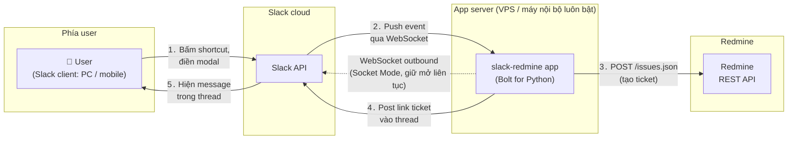

# slack-redmine

Slack app tạo Redmine ticket từ một message trong Slack.

Chọn một message → `⋮` (More actions) → **Create Redmine ticket** → modal hiện ra với Subject/Description prefill từ nội dung message (sửa được), chọn Tracker và Assignee → Submit → issue được tạo trong Redmine project tương ứng với channel, và link ticket được post lại vào thread của message gốc:

> Đã tạo Redmine ticket [Feature #21814: Subject của ticket](https://redmine.example.com/issues/21814) trong project **Project Name**

Ticket đứng tên (author) chính người tạo — app match email Slack ↔ email Redmine và impersonate qua header `X-Redmine-Switch-User`; không match được (hoặc người đó thiếu quyền) thì ticket đứng tên user của API key.

Spec chi tiết: [docs/spec.md](../../docs/spec.md).

## Kiến trúc

Dùng [Bolt for Python](https://slack.dev/bolt-python/) + **Socket Mode**: app tự mở kết nối WebSocket ra Slack, không cần public IP/HTTPS endpoint — chạy được trên VPS hoặc máy nội bộ luôn bật. App gọi Redmine qua REST API, không cần cài plugin vào Redmine.



Điểm mấu chốt: user không bao giờ kết nối trực tiếp tới app server — mọi tương tác đi qua Slack. App chỉ cần outbound internet (mũi tên nét đứt là kết nối WebSocket do app chủ động mở ra và giữ liên tục; Slack đẩy sự kiện xuống qua kết nối này, không phải app polling).

## Setup

### Phía Redmine

1. Bật REST API: Administration → Settings → API → **Enable REST web service**.
2. Tạo user riêng kiểu `slack-bot`, cấp quyền add issue vào các project liên quan, lấy API key (My account → API access key).
   - Nên dùng API key của user có quyền **admin**: cần cho tính năng *default assignee theo email* và *author = người tạo* (impersonation). Key không phải admin thì app vẫn chạy nhưng mất 2 tính năng này.

### Phía Slack ([api.slack.com/apps](https://api.slack.com/apps) → Create New App)

Cách nhanh: chọn **From a manifest**, dán nội dung [slack-app-manifest.yml](slack-app-manifest.yml) — shortcut, Interactivity và scopes được cấu hình sẵn. Lúc tạo, Slack có thể cảnh báo Socket Mode chưa enable — bình thường, vì Socket Mode cần App-Level Token mà token chỉ tạo được sau khi app tồn tại. Sau khi tạo xong app:

1. **Settings → Socket Mode** → gạt **Enable Socket Mode** → dialog hiện ra yêu cầu tạo App-Level Token (scope `connections:write` có sẵn) → Generate → copy token `xapp-...` (điền vào `SLACK_APP_TOKEN`; token chỉ hiện một lần, xem lại ở Basic Information → App-Level Tokens).
2. **OAuth & Permissions** → Install to Workspace, lấy Bot Token `xoxb-...` (điền vào `SLACK_BOT_TOKEN`).
3. `/invite` bot vào các channel muốn dùng (cần để bot post được vào thread).

<details>
<summary>Cấu hình tay (nếu không dùng manifest — chọn Blank app)</summary>

1. **Interactivity & Shortcuts**: bật Interactivity, tạo Shortcut loại *On messages*, callback ID: `create_redmine_ticket`.
2. **Socket Mode**: bật, tạo App-Level Token với scope `connections:write` (token `xapp-...`).
3. **OAuth & Permissions** — thêm Bot Token Scopes: `commands`, `chat:write`, `users:read`, `users:read.email` → Install to Workspace, lấy Bot Token (`xoxb-...`).
4. `/invite` bot vào các channel muốn dùng.

</details>

### Cấu hình app

```bash
cp .env.example .env          # điền token Slack, URL + API key Redmine
cp config.json.example config.json   # điền mapping channel ID -> project identifier
```

Lấy Slack channel ID: right-click channel → View channel details → cuối popup.

`config.json`:

```json
{
  "slack_channel_redmine_project_map": {
    "C0123456789": { "project": "project-a", "note": "#dev-team" },
    "C0987654321": "project-b"
  },
  "default_project": "general"
}
```

Value có thể là project identifier trực tiếp, hoặc object `{ "project": ..., "note": ... }` — `note` là ghi chú tự do (thường ghi tên channel, vì channel ID nhìn không ra là channel nào), app bỏ qua field này.

Channel không có trong map sẽ dùng `default_project` (message post lại sẽ ghi chú "channel này chưa được map project"). Để `default_project` là `null` nếu muốn từ chối các channel chưa map.

## Chạy

```bash
python -m venv .venv
.venv/bin/pip install -r requirements.txt   # Windows: .venv\Scripts\pip
.venv/bin/python app.py
```

Chạy như service trên Linux (systemd), tạo `/etc/systemd/system/slack-redmine.service`:

```ini
[Unit]
Description=Slack-Redmine ticket bot
After=network-online.target

[Service]
WorkingDirectory=/opt/batsg-worktool/src/slack-redmine
ExecStart=/opt/batsg-worktool/src/slack-redmine/.venv/bin/python app.py
Restart=always
RestartSec=10

[Install]
WantedBy=multi-user.target
```

```bash
sudo systemctl enable --now slack-redmine
```

## Giới hạn hiện tại (phase 1)

- Priority/status/custom field: dùng default của Redmine project.
- Assignee dropdown lấy tối đa 100 member đầu của project (giới hạn của Slack static_select).
- Message text đưa vào Description là raw Slack mrkdwn (mention dạng `<@U123>`...) — tự sửa trong modal nếu cần.
- Sửa `config.json` xong cần restart app.

Hướng mở rộng: xem mục 9 trong [docs/spec.md](../../docs/spec.md).
